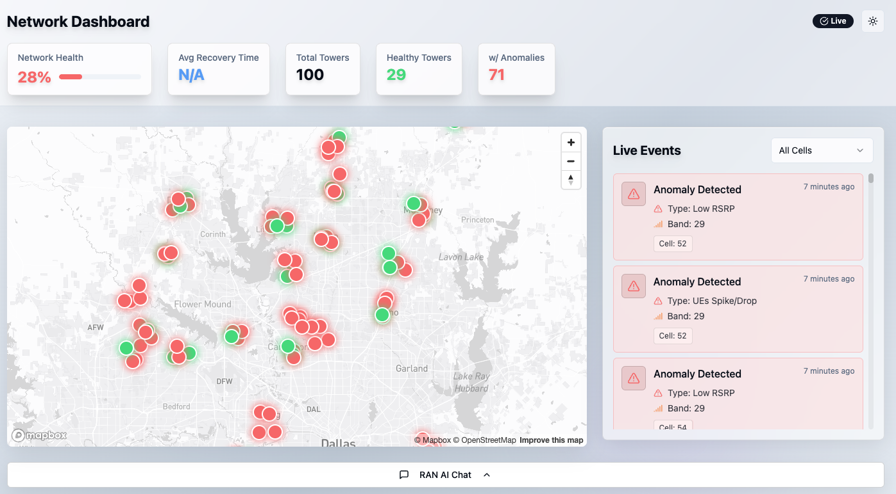

# Network Dashboard

A comprehensive real-time network monitoring dashboard for cellular tower networks, featuring interactive maps, live event feeds, anomaly detection, and AI-powered insights.



## 🌟 Features

 - 📡 **Interactive Network Map:** Real-time visualization of cell towers with status (online/offline, anomalies, recommended fixes, performance) and drill-down details.

- 📊 **Live Event Monitoring:** Stream of network events (status changes, remediations, anomalies) with filtering and detail view.

- 🤖 **RAN AI Chat Interface:** AI-powered chat for network insights, predictions, and performance analytics.

## 📋 Prerequisites

- [OpenShift CLI (`oc`)](https://docs.openshift.com/container-platform/latest/cli_reference/openshift_cli/getting-started-cli.html) - For deployment
- [Mapbox access token](https://www.mapbox.com/) - Required for map functionality  
- [Docker](https://docs.docker.com/get-docker/) or [Podman](https://podman.io/getting-started/installation) - Only if building your own image
- OpenShift cluster access - With deployment permissions
- A deployed instance of the [AI-enabled RAN project](https://github.com/rh-ssa-demos/agentic-ai-enabled-ran/tree/main)

## 🚀 Deployment on OpenShift

### 1. Deploy the Anomaly Parser
The anomaly parser extracts the required data for the dashboard from the AI RAN Event API. It must be deployed before the dashboard.

First, **login to your OpenShift cluster.**

```
oc login <your_cluster_url> -u <your_username> -p <your_password>
```

Next, **modify the anomaly parser** to point to your RAN event API.

```yml
# anomaly-parser/manifests/deployment.yml

- name: RAW_URL
  value: "http://ranchat.ai-cloud-ran-genai.svc.cluster.local:5000/api/events"
```

Finally, **deploy the anomaly service**.
```bash
oc apply -f anomaly-parser/manifests/
```

This will deploy the service and expose it through an OpenShift route. **Visit the route URL** to make sure the anomaly parser is running.

```
echo "https://$(oc get route anomaly-parser -o jsonpath='{.spec.host}')"
```

### 2. Configure Environment Variables
Before deploying the dashboard, configure the following variables in your OpenShift environment or DeploymentConfig:

- **`VITE_MAPBOX_TOKEN`** – Your Mapbox access token (required for the interactive map).
- **`VITE_ANOMALIES_URL`** – The URL of your anomaly parser service (from the route you deployed in step 1).
- **`VITE_API_BASE_URL`** – (Optional) Base URL for any additional APIs.

### 3. Build and Deploy the Dashboard
Build and push the dashboard image:
```bash
# Build and tag the image
podman build -t <registry-url>/network-dashboard .

# Push to your registry
podman push <registry-url>/network-dashboard
```
Or, if you'd like to use my image, it's here:

```
quay.io/tolarewa/network-dashboard-ui
```

Deploy the image to OpenShift:
```bash
oc new-app <registry-url>/network-dashboard \
  -e VITE_MAPBOX_TOKEN=<your-mapbox-token> \
  -e VITE_ANOMALIES_URL=<your-anomalies-service-url> \
```

### 4. Expose the Dashboard
Create a route so the dashboard is accessible externally:
```bash
oc create route edge network-dashboard \
  --service=network-dashboard \
  --port=8080 \
  --insecure-policy=Redirect
```

Your dashboard will now be available via the OpenShift route. Please note that you may need to change the TLS settings on the route depending on your OpenShift setup.

### 5. View the Dashboard
Navigate to the url of your dashboard. Find the URL in the network dashboard route.

```
echo "https://$(oc get route network-dashboard -o jsonpath='{.spec.host}')"
```

## 🏗️ Architecture

### Technology Stack
- **Frontend**: React 18 with TypeScript
- **Styling**: Tailwind CSS with shadcn/ui component library
- **State Management**: React Query (TanStack Query) for server state
- **Maps**: Mapbox GL JS for interactive maps
- **Data Fetching**: Native fetch API with fallback mechanisms

### Project Structure
```
src/
├── components/          # React components
│   ├── ui/             # shadcn/ui base components
│   ├── MapView.tsx     # Interactive map component
│   ├── LiveFeed.tsx    # Real-time event feed
│   ├── RanChatBox.tsx  # AI chat interface
│   ├── StatusHeader.tsx # Network status overview
│   └── ...
├── hooks/              # Custom React hooks
│   ├── useAnomalies.ts    # Anomaly data management
│   ├── useCallRecords.ts  # Call records and tower data
│   ├── useChatAPI.ts      # Chat interface logic
│   └── ...
├── services/           # Data services and APIs
│   ├── anomalyService.ts  # Anomaly detection logic
│   ├── callService.ts     # Call record processing
│   ├── towerService.ts    # Tower data management
│   └── ...
├── types/              # TypeScript type definitions
├── utils/              # Utility functions
└── pages/              # Route components
```

## ⚙️ Configuration

### Data Sources
The application supports multiple data source configurations:

**Tower Data**: Configured in `src/services/towerService.ts`
- Local JSON files in `public/` directory
- External API endpoints
- Mock data generation for development

**Anomaly Data**: Configured in `src/services/anomalyService.ts`
- Primary URL from environment or configuration
- Fallback to local `public/anomalies.json`
- Custom URL support via localStorage
- **Remote Data Mode**: Requires anomaly parser manifests to be deployed first

### Environment Variables
Set these environment variables for custom configurations:
- `VITE_MAPBOX_TOKEN` - Mapbox access token
- `VITE_ANOMALIES_URL` - Custom anomalies data source URL
- `VITE_API_BASE_URL` - Base URL for API endpoints


## 🔧 API Reference

### Data Types

**Tower Interface**
```typescript
interface Tower {
  id: number;
  name: string;
  lat: number;
  lng: number;
  status: "up" | "down";
  downSince?: Date;
  droppedCalls?: number;
  dropRate?: number;
  bands?: string[];
  city?: string;
  areaType?: string;
  maxCapacity?: number;
  adjacentCells?: number[];
}
```

**Event Interface**
```typescript
interface Event {
  type: EventType;
  timestamp: Date;
  message: string;
  towerId: number;
  cellId?: string;
  recoveryTime?: number;
  location?: { lat: number; lng: number };
  signalStrength?: number;
  anomalyType?: string;
  band?: string;
  sourceId?: string;
  recommendedFix?: string;
}
```

## 🔍 Troubleshooting

### Common Issues

**Map Not Loading**
- Verify Mapbox token is correct and active
- Check browser console for network errors
- Ensure HTTPS is used for production deployments

**Data Not Loading**
- Check data source URLs in service configurations
- Verify JSON file formats match expected interfaces
- Check browser network tab for failed requests
- For remote data mode: Ensure anomaly parser manifests are deployed and accessible

**Build Failures**
- Ensure all dependencies are installed: `npm install`
- Clear node_modules and reinstall if needed
- Check TypeScript errors: `npm run lint`

**Docker Issues**
- Ensure Docker daemon is running
- Check port conflicts (default: 8080)
- Verify file permissions for volume mounts

---

*Built with ❤️ using React, TypeScript, and modern web technologies*